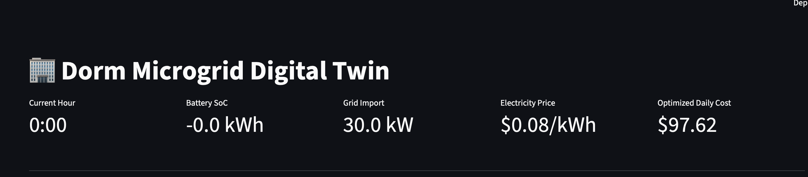
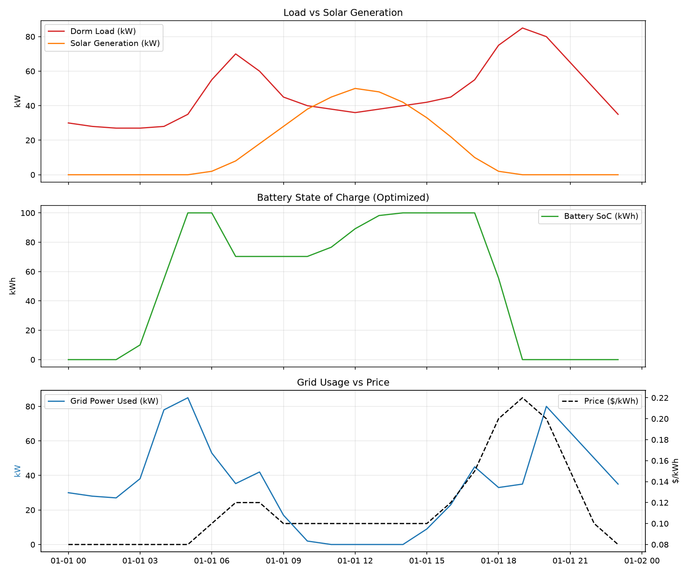

# 🏢 Dorm Microgrid Digital Twin

A full-stack digital twin that simulates a student residence's energy system — solar panels, a battery, and a grid connection — and uses linear optimization to find the cheapest possible way to run it.

Built as a personal learning project to explore energy systems modeling, optimization, and full-stack Python development.



---

## The problem

A dorm's electricity demand and its solar generation don't line up. Demand peaks twice a day — mornings (people waking up) and evenings (dinner, everyone home, lights and laptops on). Solar generation peaks once, at midday, while everyone's out at class.

That mismatch is exactly why battery storage exists in real microgrids: store cheap or free energy when it's abundant, release it when the grid gets expensive.

This project simulates that decision-making process — first by hand, then by letting a real optimizer solve it mathematically — and wraps the result in a live dashboard.

## What it does

1. **Simulates** a fictional BC student dorm's hourly electricity load, solar generation, and grid electricity prices over a 24-hour period.
2. **Optimizes** a battery charge/discharge schedule using linear programming to minimize total electricity cost, subject to real physical constraints (battery capacity, charge/discharge efficiency, power limits).
3. **Serves** that schedule live through a FastAPI backend that behaves like a simplified SCADA system — reporting current state, advancing through simulated time, and accepting manual operator overrides.
4. **Visualizes** everything in an interactive Streamlit dashboard with KPI cards, time-series charts, and live controls.

## Results

| Strategy | Total Daily Cost |
|---|---|
| Hand-written rule-based battery logic | $98.54 |
| PyPSA linear optimization | **$97.62** |

The optimizer found a strategy the hand-written rules didn't: charging the battery from cheap overnight grid power (not just excess solar), then discharging it precisely during the single most expensive hour of the day. With this project's relatively mild price swings, the saving is modest (~1%) — but it demonstrates real price arbitrage behavior that simple heuristics miss, and the gap would widen significantly with more volatile real-world pricing (e.g. Alberta's wholesale electricity market).



## Architecture

```
┌─────────────────┐     ┌──────────────┐     ┌───────────────┐     ┌─────────────┐
│  Synthetic Data  │ --> │    PyPSA     │ --> │   FastAPI     │ --> │  Streamlit  │
│  (pandas, CSV)   │     │ (HiGHS solver)│     │  (live API)   │     │ (dashboard) │
└─────────────────┘     └──────────────┘     └───────────────┘     └─────────────┘
   load / solar /         optimal battery       telemetry +           KPI cards,
   price profiles          dispatch plan       control endpoints    charts, controls
```

**Data layer:** Hourly load, solar, and price profiles generated with `pandas`, saved as CSV.

**Optimization layer:** [PyPSA](https://pypsa.org/) models the dorm as a single-bus electrical network — a load, a solar generator, a grid-import generator, and a battery storage unit — with the [HiGHS](https://highs.dev/) solver finding the cost-minimizing dispatch schedule via linear programming.

**API layer:** FastAPI exposes the optimizer's results and simulated real-time state:
- `GET /telemetry/current-state` — current hour's load, solar, price, battery SoC, grid draw
- `GET /telemetry/full-day` — the full 24-hour optimized schedule
- `GET /telemetry/summary` — total optimized cost
- `POST /telemetry/advance-hour` — step the simulation forward in time
- `POST /control/dispatch-battery` — manually override the battery (charge/discharge)

**Dashboard layer:** Streamlit polls the API and renders KPI cards, three chart sections (load vs. solar, battery state of charge, grid usage vs. price), and interactive controls for advancing time and issuing manual battery commands.

## Tech stack

- **Python 3.12**
- **[PyPSA](https://pypsa.org/)** + **[linopy](https://github.com/PyPSA/linopy)** — power systems modeling and optimization
- **[HiGHS](https://highs.dev/)** — open-source linear programming solver
- **[FastAPI](https://fastapi.tiangolo.com/)** — backend API
- **[Streamlit](https://streamlit.io/)** — dashboard frontend
- **pandas** — data handling

## Running it locally

Requires Python 3.10+.

```bash
# Clone and set up
git clone <your-repo-url>
cd microgrid_twin
python3 -m venv venv
source venv/bin/activate
pip install -r requirements.txt

# Terminal 1: generate data and run the optimizer once (optional, for standalone results)
python3 grid_model.py

# Terminal 2: start the API server
uvicorn main:app --reload

# Terminal 3: start the dashboard
streamlit run dashboard.py
```

Then open `http://localhost:8501` in your browser. Make sure the FastAPI server (Terminal 2) is running before starting the dashboard.

## Project structure

```
microgrid_twin/
├── data/
│   └── dorm_day1.csv       # synthetic load/solar/price data
├── dorm_intro.py            # early pandas exploration + hand-written battery rules
├── grid_model.py             # PyPSA network setup + optimization + matplotlib chart
├── main.py                   # FastAPI telemetry and control API
├── dashboard.py               # Streamlit dashboard
├── dorm_optimization_result.png
└── requirements.txt
```

## What I learned

This was my first time working with linear optimization, power systems modeling, and building a multi-service application (optimizer + API + dashboard talking to each other). Some specific things I picked up:

- How to frame a real-world decision problem (when to charge/discharge a battery) as an optimization problem with constraints, rather than hand-coded rules
- The difference between a heuristic strategy and a mathematically optimal one — and why the size of that gap depends heavily on the volatility of the input data
- How to structure a small multi-service system: a data/modeling layer, an API layer, and a presentation layer, each with a clear responsibility
- The practical distinction between GET and POST requests, and why state needs to live somewhere the API can read and write to across requests

## Possible next steps

- Swap in real hourly wholesale price data (e.g. Alberta's AESO pool price) to show a more dramatic cost comparison
- Add a second scenario (a cloudy day, or a high-demand exam week) to demonstrate the optimizer adapting to different conditions
- Persist the optimization results to a database instead of re-solving on every API server restart
- Extend the network to multiple buildings on a shared campus microgrid

---

*Built as a personal learning project exploring energy systems, optimization, and full-stack development.*
